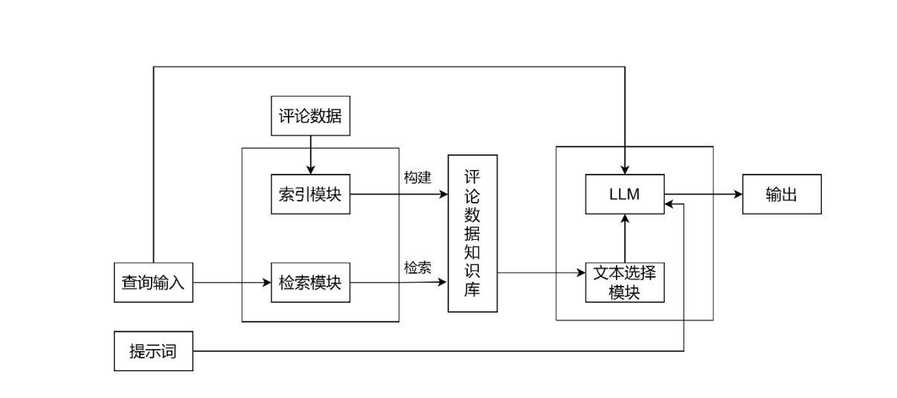
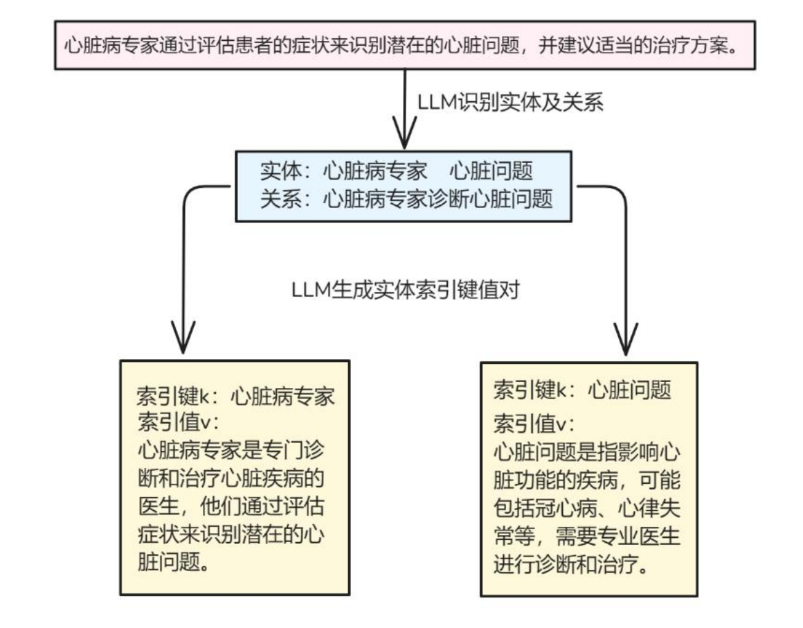
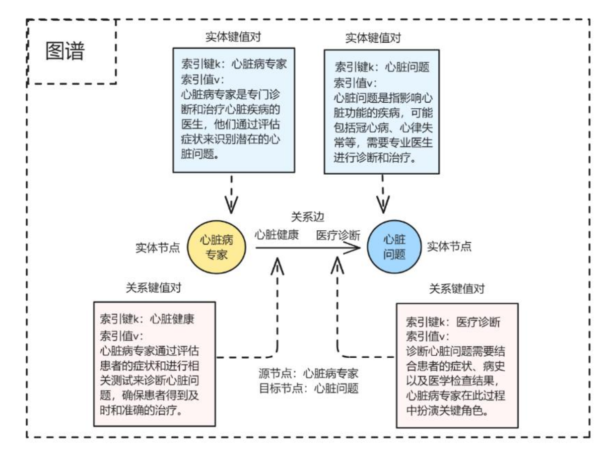
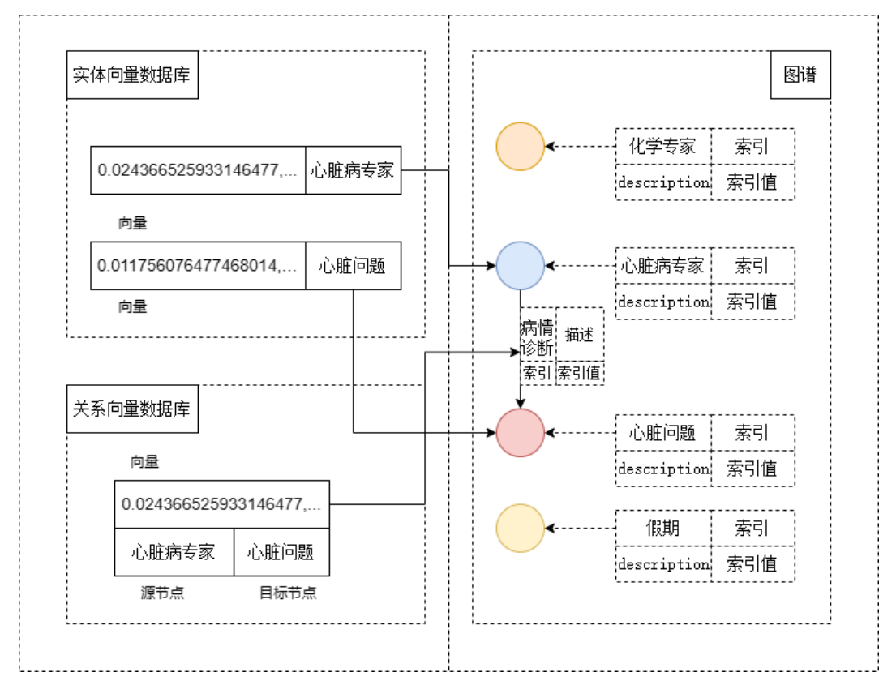
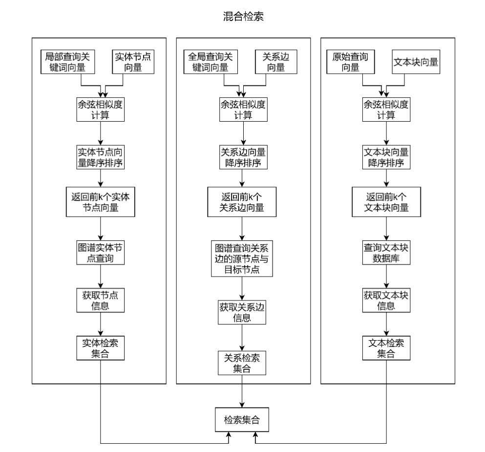
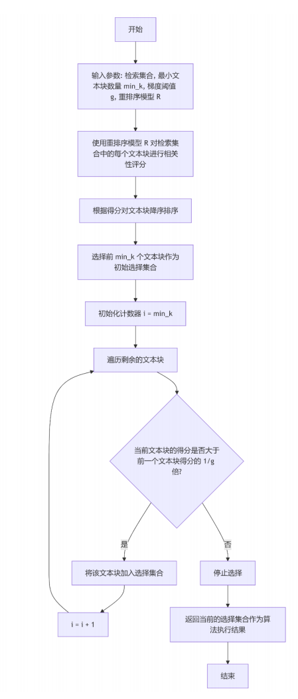

# InsightRAG（基于RAG的评论数据观点问答系统）

> 简介：基于RAG的评论数据观点问答系统，支持从社交媒体评论中高效提取和总结用户观点，融合图结构索引与混合检索策略。


## 目录
- [项目背景](#-项目背景)
- [核心架构](#-核心架构)
- [主要功能](#-主要功能)
- [技术栈](#-技术栈)
- [实验结果与分析](#-实验结果与分析)
- [演示视频](#-演示视频)
- [快速开始](#-快速开始)


## 项目背景
- 社交媒体平台（如微博、抖音）产生了海量用户评论，这些评论蕴含着丰富的社会热点和公众观点。如何从碎片化、口语化的短文本中高效提取并总结用户观点，成为舆情监测和市场研究的关键挑战。
- 传统的检索增强生成（RAG）方法在处理评论数据时面临两大难点： 信息碎片化：评论数据短且稀疏，相关观点分散在不同文本块中，检索效率低；观点型问答难：RAG擅长事实型问答，但观点问答（如总结性、统计性问题）需要复杂的语义推理和信息整合。
- 本项目基于 LightRAG 框架（Guo et al., 2024）进行二次开发。LightRAG 提出的“利用大语言模型自动构建实体与关系索引键值对，形成知识图谱”的范式为处理非结构化文本提供了高效路径。InsightRAG 继承并扩展了这一思想，针对社交媒体评论数据的观点问答任务，进一步引入了混合检索策略（实体检索 + 关系检索 + 文本检索）和基于梯度的文本块选择算法，提升了系统在信息碎片化场景下的检索效率和观点生成质量。


## 核心架构
 问答系统模型基本框架
 LLM 构建索引键值对示例
 初始图谱
 向量数据库与图谱关联
 混合检索流程
 基于梯度的文本块选择算法

关键模块及其作用：
- 索引模块：
    对原始评论进行清洗、分块，构建文本向量库。
    利用大语言模型（LLM）自动识别评论中的实体及关系，构建知识图谱（Neo4j），并对实体和关系进行向量化存储（Milvus）。
    形成“文本-实体-关系”三位一体的索引结构。
- 查询处理模块：
    将用户原始问题通过LLM分解为局部查询关键词（关注细节实体）和全局查询关键词（关注主题概念）。
    对关键词和原始查询进行向量化。
- 检索模块：
    实体检索：基于局部关键词从实体向量库中匹配最相关的实体节点，并获取其描述信息。
    关系检索：基于全局关键词从关系向量库中匹配最相关的关系边，获取其解释信息。
    文本检索：基于原始查询从文本块向量库中匹配最相关的评论文本。
    三者结果融合为初始检索集合。
- 文本选择模块：
    采用基于梯度的文本块选择算法，利用重排序模型（如bocha-semantic-reranker）对检索结果进行评分，动态筛选出与查询最相关的文本块，过滤噪声。
- 生成模块：
    将筛选后的上下文、用户查询和提示词输入LLM（如DeepSeek-V3），生成结构化、观点鲜明的答案。

## ✨ 主要功能
- **功能1**：观点问答：支持自然语言提问，系统从大量评论中总结出用户观点
- **功能2**：可解释性溯源：回答下方展示经梯度选择后的重排上下文，用户可查看系统依据哪些评论生成答案。
- **功能3**：混合检索增强：同时利用文本语义、实体信息和关系路径，提升复杂观点问题的召回率和准确性


## 技术栈
- **编程语言**：Python
- **框架与库**：大语言模型：智谱 GLM-4-Flash、DeepSeek-V3（通过API调用）, 嵌入模型：智谱 embedding-3, 重排序模型：博查 bocha-semantic-reranker（API）, 前端界面：Chainlit
- **数据库**：文档存储：MongoDB（文本块）, 图数据库：Neo4j（知识图谱）, 向量数据库：Milvus（文本向量、实体向量、关系向量）
- **其他**：PyTorch


## 实验结果与分析
- 基于从抖音爬取的25万条评论数据，选取1万条构建知识库，生成1558个观点问答对进行评测。主要结论如下：
- 混合检索策略相较于基础RAG，响应相关性提升 4.1% ，忠实度提升 3.2%，验证了融合实体、关系与文本检索的有效性。
- 上下文召回率与噪声敏感性：混合检索召回率相较于基础RAG提升 2.4%；噪声敏感度相较于基础RAG降低 42.2%，说明系统能捕捉关键信息并有效抵抗噪声干扰。
- LLM 对比：DeepSeek‑V3 相较于 GLM‑4‑Flash，响应相关性提升 1.1%，忠实度提升 1.9%
- 使用基于梯度的文本块选择算法后，响应相关性提升 0.3%，忠实度提升 2.1%。


## 演示视频
<div align="center">
  
</div>
<div align="center">
  
</div>


## 快速开始
### 数据库配置
InsightRAG 依赖 MongoDB（文本块存储）、Neo4j（知识图谱）和 Milvus（向量存储）
### 模型服务配置
```bash
ZHIPU_API_KEY=your_zhipuai_api_key          # 用于 GLM-4-Flash 和 embedding-3
DEEPSEEK_API_KEY=your_deepseek_api_key      # 可选，用于 DeepSeek-V3
BOCHA_API_KEY=your_bocha_api_key            # 用于 bocha-semantic-reranker
```
```bash
# 1. 克隆仓库
git clone https://github.com/jingluo19877-gif/InsightRAG.git
cd InsightRAG
# 2. 创建 conda 环境（推荐 Python 3.10）
conda create -n insightrag python=3.10 -y
conda activate insightrag
# 3. 安装依赖
pip install -r requirements.txt
```
### 运行系统
```bash
chainlit run test_chat.py
```
